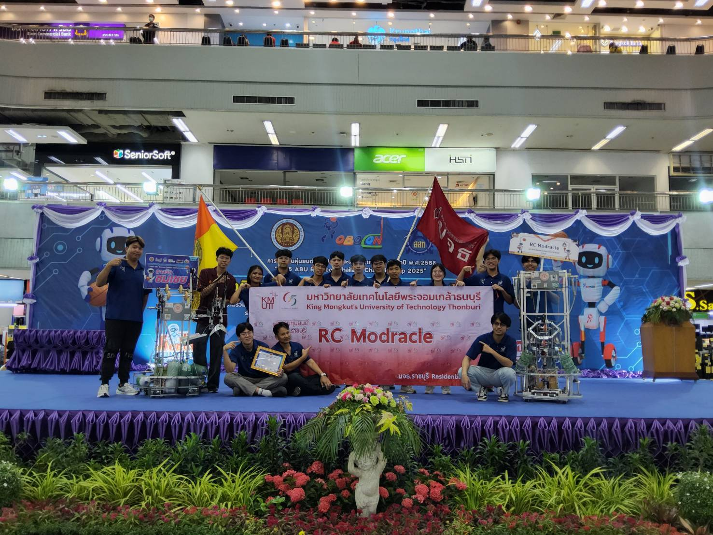
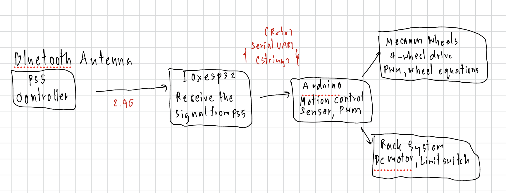

# ABU Robocon 2025 - RC MODRACLE

## My Role

- **Sole Engineer — Manual Robot (R2)**
- Embedded Software Development (ESP32 + Arduino)
- Electronics Design & Wiring
- Mechanical Integration (SolidWorks, Laser Cutting, Board Layout)

---

## Overview

TPA Robot Cup 2025 (ABU Robocon 2025) — National Robotics Competition by TESA (Thailand).  
The challenge was to build basketball-shooting robots to score points. My team built two robots: one semi-autonomous and one manual — I was responsible for the manual robot.

I handled the full software stack for this robot — from system architecture and board layout planning, to laser cutting, wiring, and writing all control programs. The system runs on an IOXESP32 and an Arduino communicating via Serial. The IOXESP32 receives joystick input from a PS5 controller and forwards raw values to the Arduino, which handles motion control (forward, backward, turning, rotation) and sensor management including rack movement.

---

## Videos

---

## Development Process

### 1. System Design & Hardware

Before building, I drew an overview diagram in **Miro** to plan the full system architecture:

- Analyzed current draw across the system and selected appropriate wire gauges
- Designed board layout within the limited space on the robot chassis
- Selected sensor modules suited to each task
- Used **Laser Cutting** to cut acrylic sheets for mounting control boards on the robot frame

**Why IOXESP32 + Arduino instead of a single board:**  
The IOXESP32 has a dedicated external antenna connector, providing more stable Bluetooth reception than a standard ESP32. It sends raw joystick values to the Arduino, which handles all processing and sensor control.

### 2. Communication System

- **IOXESP32** receives input from PS5 Controller using the library:  
  [`ps5-esp32`](https://github.com/rodneybakiskan/ps5-esp32)
- Data is sent to **Arduino** via Serial (RX/TX) as a `String`

### 3. Motor Control

- Drive system uses **4-Wheel Mecanum Drive**
- Mecanum wheel equations used to calculate individual wheel speeds, controlled via **PWM**
- Rack system controlled by motor + **Limit Switch**

### 4. Testing & Debugging

**Issue:** Motor noise caused the robot to move on its own without any joystick input  
**Fix:** Added a **5% error threshold** to filter out noise from joystick values

### 5. Competition Result

- Result: **5th Place**
- In-field issue: 2.4G Bluetooth signal was heavily interfered with by other signals in the arena, causing the controller to disconnect during matches
- Lesson learned: For 2026, the communication protocol will be upgraded to **5G or 6G** to avoid this problem

---

## Personal Reflection

**Hardest part:**  
Debugging the full communication chain — PS5 → IOXESP32 → Arduino → Sensors — was the most challenging part of this project. Any break in the chain caused unpredictable behavior, and tracing the root cause required patience. Reconfiguring the software on the fly when mechanical issues arose mid-development also pushed me to stay adaptable under pressure.

**What I learned:**
- How to implement and debug inter-board Serial communication
- How to properly measure current draw and voltage before connecting components — a habit that prevented hardware damage

**Overall:**  
I'm proud of placing 5th in my first ever robotics competition. The experience showed me what I'm capable of when I take full ownership of a system. The signal interference issue was frustrating, but it gave me a clear direction for improvement — and I'm taking those lessons directly into the 2026 season.

---

## Code

- [IOXesp32_receiverPs5](code/Esp_receiverPs5.ino)
- [Arduino_controlmotor](code/Arduino_motor_robotB.ino)

---
