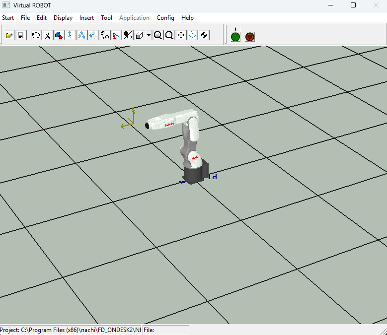
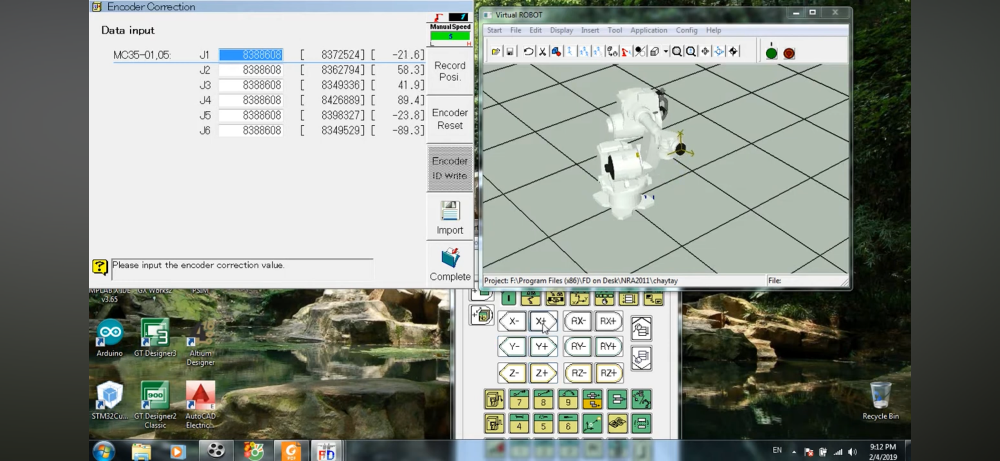

# Robotics & Automation Competition 4

## My Role

- **Competitor — Type 2 (Industrial Robot Programming)**
- Nachi Robot Programming (Virtual ROBOT / FD On Desk)
- Encoder Calibration & Homing Procedure
- Lua Script Programming for robot motion control

---

## Competition Details

**Event:** [Robotics & Automation Competition 4](https://www.camphub.in.th/robotics-automation-competition-4/)  
**Type:** Type 2 — Industrial Robot Arm Programming (Nachi)  
**Result:** Completed training and gained hands-on Nachi robot programming experience

The competition required participants to program a **Nachi 6-axis industrial robot arm** using Nachi's **FD On Desk** (Virtual ROBOT) simulation environment. Tasks covered robot calibration, teach pendant operation, and writing motion programs in **Lua** — Nachi's scripting language.

---

## Development Process

### 1. Robot Simulation Environment

Used **Nachi Virtual ROBOT (FD On Desk)** — an offline simulation platform for Nachi industrial robots:

- Loaded a 6-DOF Nachi robot model into the virtual workspace
- Practiced jogging all 6 axes (J1–J6) in joint and Cartesian mode
- Used the simulated teach pendant (X±, Y±, Z±, RX±, RY±, RZ±) to position the TCP

### 2. Encoder Calibration

Performed the full **Encoder Correction** procedure:

- Read raw encoder counts for all 6 joints (J1–J6)
- Compared against reference positions to compute correction offsets
- Wrote corrected values back to the robot controller
- This procedure is required whenever a robot is moved without power or after maintenance — a real industrial skill

### 3. Lua Programming

Wrote motion programs in **Lua** — Nachi's built-in scripting language for the FD controller:

- Defined named positions (teach points) via teach pendant
- Wrote motion sequences: `MOVJ` (joint interpolation), `MOVL` (linear interpolation)
- Controlled speed, acceleration, and zone parameters per move
- Structured programs with loops and conditional logic for task completion

---

## Personal Reflection

**Hardest part:**  
The encoder calibration procedure — getting all 6 joint offsets correct before any motion was possible. One wrong value causes the robot to move to the wrong position, which in a real robot means a crash risk. Working methodically through each joint and verifying the offset before writing it was genuinely challenging.

**What I learned:**
- How industrial robot programming differs from microcontroller programming — the focus is on safe motion sequences, not raw hardware control
- How to use Lua in an industrial context — very different from scripting; every line translates to physical movement
- How encoder homing works and why it matters for repeatable robot positioning

**Overall:**  
This was my first contact with a real industrial robot arm. The gap between controlling a motor with PWM and commanding a 6-axis robot is huge — and experiencing that gap firsthand gave me a much clearer picture of what industrial automation actually involves.

---

## Images

---
