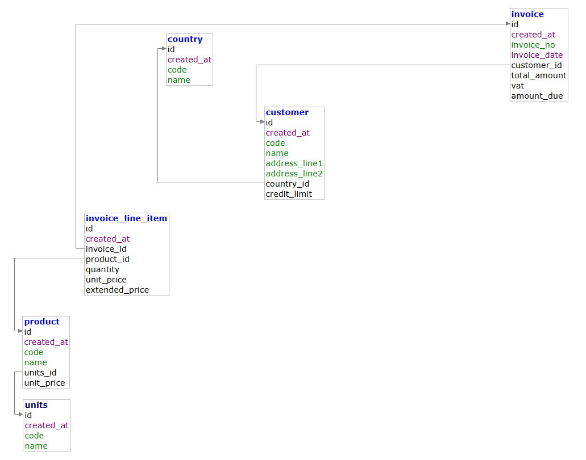

# InvoiceDoc v2 — Invoice Management System

[](https://react.dev/)
[](https://nodejs.org/)
[](https://www.postgresql.org/)
[](https://www.docker.com/)
[](.)

---

## My Role

- **Full-Stack Developer** — sole developer across frontend, backend, and database
- Database Schema Design & Normalization (PostgreSQL)
- REST API Development (Node.js / Express)
- Frontend UI Development (React 18 + Vite)
- Docker Containerization & Deployment

---

## Overview

A full-stack Invoice Management System built as a coursework project covering the complete software development lifecycle — from relational database design to containerized deployment.

The system supports full CRUD for Customers, Products, Invoices, and Receipts, with a Reports module featuring advanced filtering and analytics. Designed to run locally via Docker with a single command.

---

## Development Process

### 1. Database Design

Designed a normalized relational schema in PostgreSQL with referential integrity enforced at the database level:



**Schema overview:**

| Table | Purpose |
|---|---|
| `country` | Country master data |
| `units` | Unit of measurement |
| `customer` | Customer info with credit limit |
| `product` | Product catalog with unit price |
| `sales_person` | Sales person master (Lab 8 migration) |
| `invoice` | Invoice headers with VAT and amount due |
| `invoice_line_item` | Line items with `UNIQUE(invoice_id, product_id)` |
| `receipt_header` | Payment receipts with payment method constraint |
| `receipt_line` | Receipt–Invoice links with amount tracking |

**Key design decisions:**
- All foreign keys use `ON DELETE RESTRICT` / `ON UPDATE CASCADE` — no orphan records
- `invoice_line_item` enforces `UNIQUE(invoice_id, product_id)` — duplicate products auto-merge
- `receipt_line` uses `CHECK` constraints to enforce payment math at DB level
- Database trigger `trg_receipt_line_refresh_total` auto-updates `receipt_header.total_received` on every insert/update/delete on `receipt_line`
- `invoice_received_view` — SQL view that computes remaining balance per invoice across all receipts
- Incremental migration strategy: `001_schema.sql` (baseline) → `002_lab8_sales_person.sql` (migration) — safe to rerun with `IF NOT EXISTS`

---

### 2. Backend API

Built with **Express 4** using a clean layered architecture:

```
routes/        → URL definitions and HTTP method binding
controllers/   → Request validation, response formatting
services/      → Business logic and parameterized DB queries
models/        → Zod schemas for input validation
db/pool.js     → PostgreSQL connection pool (pg)
```

**Key patterns:**
- All DB queries use **parameterized statements** — no SQL injection risk
- Zod validation on all create/update inputs before hitting the database
- Cascading delete with force-delete option: customer/product deletion blocked if invoices exist, override with confirmation
- Auto-numbering: `C{ID}` for customers, `P{ID}` for products, `INV-{ID}` for invoices, `RCT{YY}-{NNNNN}` for receipts

**API surface:**
- `GET/POST /api/customers` · `GET/PUT/DELETE /api/customers/:id`
- `GET/POST /api/products` · `GET/PUT/DELETE /api/products/:id`
- `GET/POST /api/invoices` · `GET/PUT/DELETE /api/invoices/:id`
- `GET/POST /api/receipts` · `GET/PUT/DELETE /api/receipts/:id`
- `GET /api/sales-persons`
- `GET /api/reports/sales-by-product`
- `GET /api/reports/sales-by-customer`
- `GET /api/reports/sales-by-product-monthly`

---

### 3. Frontend

Built with **React 18** and **Vite 5**, structured around reusable components:

- `DataList.jsx` — generic paginated table with server-side search, sort, and pagination; shared across all entity lists
- `InvoiceForm.jsx` — invoice header + line items form (create/edit)
- `LineItemsEditor.jsx` — add/remove/reorder line items; insert row between existing rows
- `ListPickerModal.jsx` — generic modal picker base (extended by Customer, Product, SalesPerson pickers)
- `SearchableSelect.jsx` — debounced server-side searchable dropdown
- `Modal.jsx` — `ConfirmModal` and `AlertModal` replacing native browser dialogs
- Reports page with composable filter components: `DateRangeFilter`, `ProductFilter`, `CustomerFilter`, `YearMonthFilter`, `PaginationFilter`

---

### 4. Docker & Deployment

The full stack runs in 3 containers managed by Docker Compose:

```
docker-compose.yml
├── database   → postgres:17-alpine, port 15432, volume: pgdata
├── server     → Express API, port 4000, depends on: database (healthy)
└── client     → React (built with Vite, served static), port 3000
```

- Database uses a **healthcheck** (`pg_isready`) — server waits until DB is ready before starting
- Schema is auto-applied on first container start via `database/init/01_schema.sql`
- `setup_db.js` handles conditional seeding: seeds only when tables are empty, skips if data exists
- Full reset available via `npm run db:reset` (DROP all + recreate + seed)
- CI workflow via **GitHub Actions** (`build.yml`) validates the build on every push

---

### 5. Challenges & Debugging

**Challenge:** Receipt payment math — ensuring `amount_remaining = full_amount_due - amount_already_received` and `amount_still_remaining = amount_remaining - amount_received_here` are always consistent across inserts and updates.  
**Fix:** Enforced all payment math as `CHECK` constraints directly in the schema — the database rejects any inconsistent state before it reaches the application layer.

**Challenge:** `total_received` in `receipt_header` going out of sync when receipt lines are added or removed.  
**Fix:** PostgreSQL trigger `trg_receipt_line_refresh_total` recalculates the total automatically after every `INSERT`, `UPDATE`, or `DELETE` on `receipt_line`.

---

## Personal Reflection

**What I learned:**
- How to design a normalized relational schema with constraints, views, and triggers — not just tables
- How to structure a full-stack project cleanly with separated layers (routes → controllers → services)
- How to use Docker Compose to wire multiple services together with health checks and dependency ordering
- How incremental database migrations work in practice — adding features without dropping existing data

**Overall:**
This was the most complete project I had built end-to-end by myself. Designing the schema first, then building the API around it, then the UI — made me understand how each layer depends on the one below it. The database trigger and CHECK constraints were the most satisfying parts to get right.

---

## Code

| Module | Path |
|---|---|
| Frontend (React) | [code/client/](code/client/) |
| Backend (Express) | [code/server/](code/server/) |
| Database Schema | [code/database/sql/001_schema.sql](code/database/sql/001_schema.sql) |
| Lab 8 Migration | [code/database/sql/002_lab8_sales_person.sql](code/database/sql/002_lab8_sales_person.sql) |
| Seed Data | [code/database/sql/003_seed.sql](code/database/sql/003_seed.sql) |
| Docker Compose | [code/docker-compose.yml](code/docker-compose.yml) |
| Project Repository | [github.com/llbumpbumpll/InvoiceDoc2](https://github.com/llbumpbumpll/InvoiceDoc2) |
