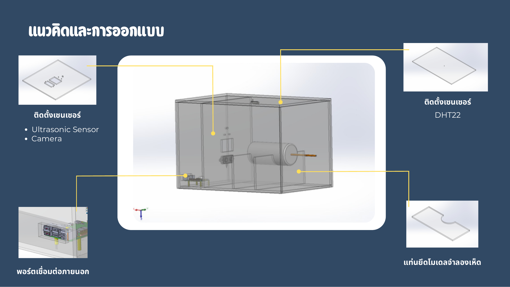
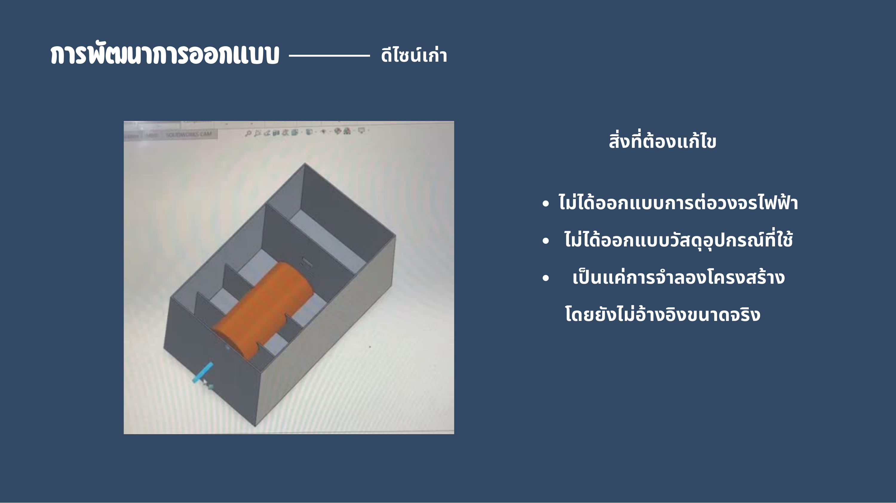
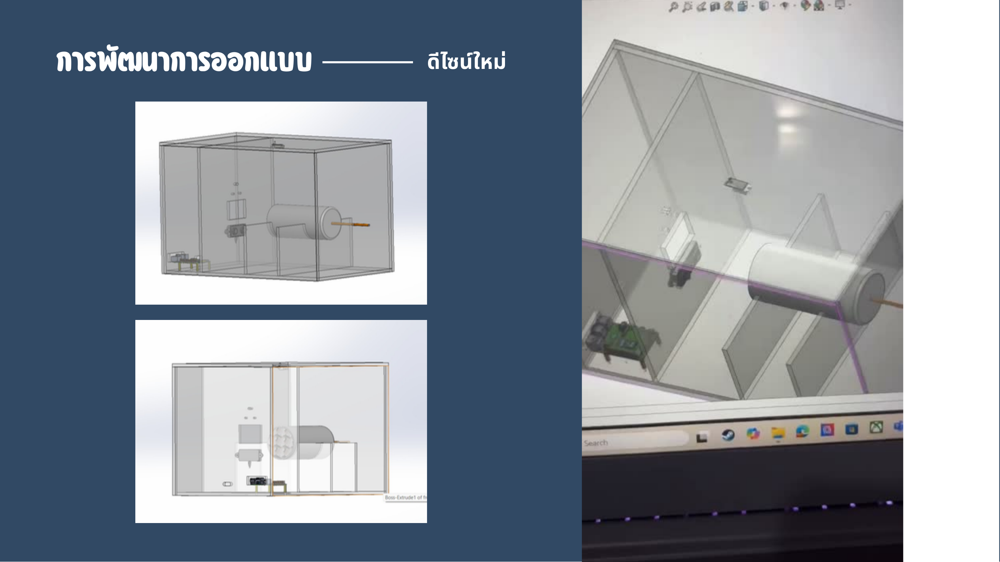
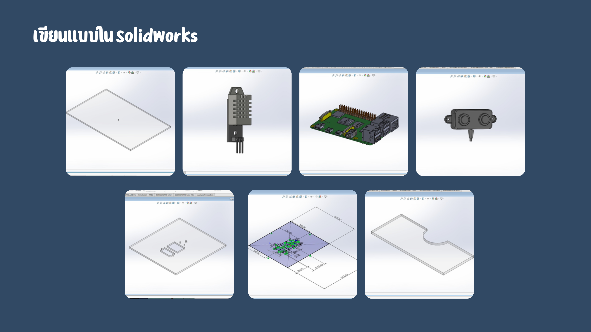
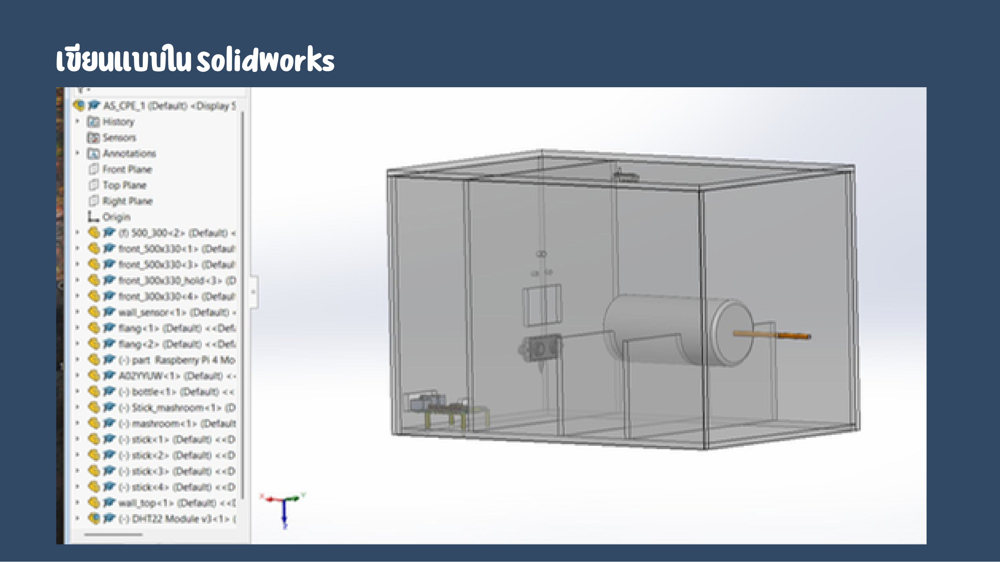
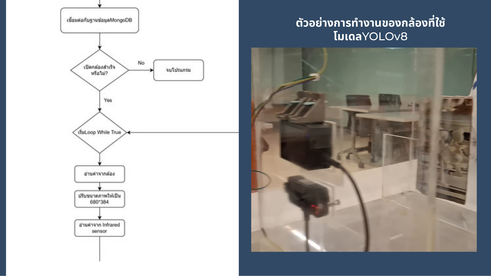

# Mushroom Detection — Automatic Inspection Prototype

## My Role

- **Mechanical Designer** — designed the full prototype structure
- 3D Structural Design (SolidWorks)
- Component Layout & Enclosure Planning
- Hardware Integration Planning (camera, sensors, boards)

---

## Overview

A group project for **CPE101 — Introduction to Computer Engineering** (Year 1).

The goal was to build an automatic mushroom inspection prototype that detects mushrooms using a camera, classifies their maturity by size, and reports environmental conditions (temperature, humidity) to farmers via LINE Notify.

My contribution was the full mechanical design — planning and modeling the physical structure of the prototype in SolidWorks, including where each component (camera, distance sensor, Raspberry Pi, OLED display, DHT11 sensor) would be mounted and how it would all fit together.

The software was developed by teammates and runs on a Raspberry Pi, using YOLOv8 for mushroom detection, DeepSort for object tracking, and a Flask LINE Bot webhook for remote monitoring.

---

## Development Process

### 1. Mechanical Design (My Work)

Designed the full prototype enclosure and component layout using **SolidWorks**:



- Determined mounting positions for each sensor and board to minimize interference and maintain clear camera line-of-sight
- Designed the structural frame to be stable and repeatable for prototype testing
- Planned cable routing paths to keep wiring clean and accessible for debugging
- Iterated on the design based on actual sensor dimensions and board footprints

**Design iterations:**

| Old design (v1) | New design (v2) |
|---|---|
|  |  |

v1 issues: no electrical routing, no real component dimensions. v2 rebuilt from scratch using actual sensor and board footprints.

**Component models drawn in SolidWorks:**



**Full assembly:**



### 2. System Overview (Team)

The software stack runs on a **Raspberry Pi**:

```
Camera (USB)
  └── YOLOv8 (mushroom detection, class 0)
        └── DeepSort (multi-object tracking, persistent ID)
              └── Size estimation via A02YYUW distance sensor + pixel math
                    └── Maturity classification: mature (1.5–2.0 cm) / immature
                          └── MongoDB Atlas (log every 3 seconds)
                                └── LINE Bot webhook (status, temperature, humidity alerts)
```

**Sensors used:**
- **DHT11** — temperature & humidity (GPIO17)
- **A02YYUW** — ultrasonic distance (range 0–4500mm) for real-size estimation
- **SSD1306 OLED (128×32, I2C)** — live temperature/humidity display on device

**Size estimation formula:**
```
pixel_size_mm = sensor_width_mm / image_width_px
bbox_width_mm = bbox_width_px × pixel_size_mm
real_width_mm = (bbox_width_mm × distance_mm) / focal_length_mm
```

**LINE Bot commands:**
- `สถานะเห็ด` — current mature/immature count
- `อุณหภูมิ` / `ความชื้น` — latest sensor readings
- `ช่วยเหลือ` — contact info
- Auto-broadcast alerts when temperature or humidity goes out of safe range

### 3. Result



- Gained hands-on experience in **structural design for embedded hardware prototypes**
- The prototype successfully ran detection and reported mushroom status over LINE

---

## Personal Reflection

**Hardest part:**  
Planning the enclosure layout before the hardware arrived — I had to design around component datasheets and board dimensions without being able to physically test fit. Iterating the SolidWorks model multiple times to accommodate the actual sensor sizes was the most challenging part.

**What I learned:**
- How to use SolidWorks to design a functional enclosure — not just aesthetics, but real mounting constraints
- How mechanical design directly affects how easy or hard it is to wire and debug hardware
- How to read component datasheets and translate physical dimensions into a CAD model

**Overall:**  
This was my first time designing a prototype structure meant for actual hardware. Seeing the physical machine run — with sensors I planned the placement for — made the SolidWorks work feel concrete and worthwhile. It gave me a clear sense of how mechanical and electronic design have to work together from the start.

---

## Code

| Module | Path |
|---|---|
| Main Detection (YOLOv8 + Tracking) | [code/maincode.py](code/maincode.py) |
| LINE Bot Webhook | [code/webhook.py](code/webhook.py) |
